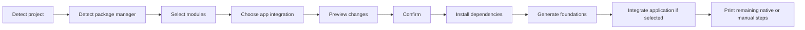

<div align="center">

# bink-rn-stack

Set up an opinionated foundation for an existing React Native or Expo application.

Choose the tools you want, preview every change, and decide whether the CLI should integrate them for you.

</div>

## What it does

`bink-rn-stack` inspects an existing application and guides it through a predictable setup flow:



- Detects Expo and bare React Native projects.
- Detects npm, Yarn, pnpm, or Bun.
- Generates React Navigation for bare projects and offers React Navigation or Expo Router for Expo.
- Offers an interactive module selector or non-interactive flags.
- Shows dependencies, generated files, conflicts, and native steps before changing anything.
- Installs only missing dependencies.
- Composes shared providers, stores, and barrel exports without duplicate files.
- Optionally integrates providers, initialization imports, navigation, Babel, and Expo configuration when the target files use a supported structure.
- Audits installed dependencies, generated files, integrations, and navigation with a read-only doctor command.
- Protects existing files unless an overwrite is explicitly requested.

## Supported modules

| Module                    | Foundation                                                                               | Native rebuild |
| ------------------------- | ---------------------------------------------------------------------------------------- | :------------: |
| **Navigation**            | Typed React Navigation native stack or an Expo Router file-based root                    |      Yes       |
| **Axios**                 | Configured client, API configuration, typed errors, and shared exports                   |       No       |
| **Unistyles**             | Themes, breakpoints, type augmentation, runtime configuration, and persisted theme state |      Yes       |
| **Zustand**               | State management foundation with an MMKV persistence adapter                             |      Yes       |
| **React Hook Form + Zod** | Typed React Native input, example schema, inferred values, and reusable form hook        |       No       |
| **TanStack Query**        | Query client, React Native lifecycle handling, and provider composition                  |       No       |
| **i18n**                  | Typed resources, device-language detection, MMKV persistence, and language state         |      Yes       |

When multiple modules need the same foundation, such as MMKV storage, the generated output is shared instead of duplicated.

## Requirements

- Node.js 20 or newer.
- An existing Expo or bare React Native application.
- npm, Yarn, pnpm, or Bun configured through `packageManager` or a lockfile.

## Quick start

Run the CLI directly from npm—no cloning or global installation required:

```bash
npx bink-rn-stack init /path/to/your-app
```

The interactive flow walks through module selection, navigation, and app integration. It then prints the complete setup preview before asking for confirmation. No dependency or source file is changed before that confirmation.

## Usage

### Interactive setup

```bash
npx bink-rn-stack init ../my-app
```

### Install the complete stack

```bash
npx bink-rn-stack init ../my-app --modules all
```

Expo will still ask which navigation library to use. Pass the choice explicitly for scripts:

```bash
npx bink-rn-stack init ../my-app --modules all --navigation expo-router
npx bink-rn-stack init ../my-app --modules all --navigation react-navigation
```

Preserve an existing navigation setup explicitly with:

```bash
npx bink-rn-stack init ../my-app --modules all --navigation keep
```

### Install selected modules

```bash
npx bink-rn-stack init ../my-app --modules navigation,axios,react-hook-form,tanstack-query --navigation expo-router
```

### Preview without making changes

```bash
npx bink-rn-stack init ../my-app --modules all --dry-run
```

### Run non-interactively with manual integration

```bash
npx bink-rn-stack init ../my-app --modules all --navigation expo-router --yes
```

### Run non-interactively with automatic integration

```bash
npx bink-rn-stack init ../my-app --modules all --navigation expo-router --integrate --yes
```

Non-interactive runs use manual integration when neither `--integrate` nor `--no-integrate` is passed.

### Inspect project detection as JSON

```bash
npx bink-rn-stack init ../my-app --json
```

### Check an initialized project

```bash
npx bink-rn-stack doctor ../my-app
```

### Add modules later

```bash
npx bink-rn-stack add ../my-app --modules react-hook-form,tanstack-query
```

`add` reconciles the complete tracked stack, so shared provider and barrel files include both the
existing and newly selected modules. Use `--integrate` to apply supported application changes.

### Update generated foundations

```bash
npx bink-rn-stack update ../my-app
```

`update` regenerates every module recorded in `.bink-rn-stack.json` using the current CLI templates.
It does not arbitrarily upgrade already installed dependency versions.

### Remove modules

```bash
npx bink-rn-stack remove ../my-app --modules axios,react-hook-form
```

`remove` deletes generated paths only when their hashes still match the manifest. It uninstalls only
dependencies that were originally installed by this CLI and are no longer required by another
tracked module. Pass `--keep-dependencies` to preserve them.

## Command options

```text
npx bink-rn-stack init [path] [options]
```

| Option                    | Description                                                          |
| ------------------------- | -------------------------------------------------------------------- |
| `-m, --modules <modules>` | Select `all` or a comma-separated module list                        |
| `--navigation <library>`  | Select `keep`, `react-navigation`, or `expo-router`                  |
| `--integrate`             | Automatically update supported application and configuration files   |
| `--no-integrate`          | Generate foundations and print manual integration steps              |
| `--dry-run`               | Print the complete preview without installing or generating anything |
| `-y, --yes`               | Apply the preview without asking for confirmation                    |
| `--force`                 | Replace existing generated paths whose contents differ               |
| `--json`                  | Print only the project-detection result as JSON                      |
| `-h, --help`              | Show command help                                                    |

Available module names are `navigation`, `axios`, `unistyles`, `zustand`, `react-hook-form`, `tanstack-query`, and `i18n`.

### Lifecycle command options

```text
npx bink-rn-stack add [path] [options]
npx bink-rn-stack update [path] [options]
npx bink-rn-stack remove [path] [options]
```

| Option                    | Commands        | Description                                                   |
| ------------------------- | --------------- | ------------------------------------------------------------- |
| `-m, --modules <modules>` | `add`, `remove` | Select `all` or a comma-separated module list                 |
| `--navigation <library>`  | `add`           | Choose navigation when adding the Navigation module           |
| `--integrate`             | `add`, `update` | Apply supported application integrations                      |
| `--no-integrate`          | `add`, `update` | Preserve application files and print manual steps             |
| `--keep-dependencies`     | `remove`        | Do not uninstall dependencies previously installed by the CLI |
| `--dry-run`               | All             | Print the lifecycle preview without changing the project      |
| `-y, --yes`               | All             | Apply without asking for confirmation                         |
| `--force`                 | All             | Replace drifted generated paths after reviewing the preview   |

All lifecycle commands require a valid `.bink-rn-stack.json` created by `init`.

## Doctor

`doctor` is a read-only health check for an application previously initialized by `bink-rn-stack`:

```bash
npx bink-rn-stack doctor /path/to/your-app
```

It checks:

- Expo or bare React Native project detection.
- Package-manager detection and conflicting lockfiles.
- `.bink-rn-stack.json` structure and CLI version drift.
- Dependencies required by the modules recorded in the manifest.
- Missing or modified generated files.
- Missing or modified automatically integrated files.
- Whether the recorded navigation library is still detected.

Missing dependencies, missing generated files, unsafe manifest paths, and invalid manifests are errors. File drift and CLI-version differences are warnings because they may be intentional.

Warnings do not fail the normal command. Use strict mode in CI to make warnings fail too:

```bash
npx bink-rn-stack doctor ../my-app --strict
```

Use structured output for scripts:

```bash
npx bink-rn-stack doctor ../my-app --json
```

| Option       | Description                                        |
| ------------ | -------------------------------------------------- |
| `--json`     | Print the complete doctor report as JSON           |
| `--strict`   | Return a failing exit code for warnings and errors |
| `-h, --help` | Show command help                                  |

## App integration modes

When Navigation, Unistyles, TanStack Query, or i18n is selected, interactive runs ask how application integration should be handled:

| Mode          | CLI flag         | Behavior                                                               |
| ------------- | ---------------- | ---------------------------------------------------------------------- |
| **Automatic** | `--integrate`    | Preview and apply supported changes to existing app and config files   |
| **Manual**    | `--no-integrate` | Leave existing app and config files untouched and print required steps |

Modules that do not require application-level changes—Axios, Zustand, and React Hook Form—skip this question.

Automatic mode is still preview-first:

```text
App integration: Automatic

Automatic app integration
  ~ src/app/_layout.tsx
    - Wrap the root with AppProviders
    - Import the i18n configuration
    - Import the Unistyles configuration
  + babel.config.js
    - Create Babel configuration with the Unistyles plugin
```

Manual mode shows the work left for the developer:

```text
App integration: Manual

Manual app integration
  - Wrap the application root with AppProviders.
  - Import src/i18n/config.ts before the application renders.
```

## Generated structure

The non-navigation modules compose this shared foundation:

```text
src/
├── api/
│   ├── client.ts
│   ├── config.ts
│   ├── errors.ts
│   ├── index.ts
│   └── types.ts
├── forms/
│   ├── fields/
│   │   └── FormTextInput.tsx
│   ├── login/
│   │   └── loginForm.ts
│   └── index.ts
├── i18n/
│   ├── locales/
│   │   └── en.json
│   ├── config.ts
│   ├── i18next.d.ts
│   ├── index.ts
│   ├── resources.ts
│   └── types.ts
├── providers/
│   ├── AppProviders.tsx
│   ├── index.ts
│   ├── QueryProvider.tsx
│   └── QueryProvider.types.ts
├── query/
│   ├── index.ts
│   └── queryClient.ts
├── stores/
│   ├── index.ts
│   ├── languageStore.ts
│   ├── mmkvStorage.ts
│   ├── themePreference.ts
│   └── themeStore.ts
└── theme/
    ├── breakpoints.ts
    ├── index.ts
    ├── themes.ts
    ├── types.ts
    ├── unistyles.d.ts
    └── unistyles.ts
```

The exact tree depends on the selected modules. Shared barrel files are composed from the final selection.

The React Hook Form foundation includes a reusable controlled `TextInput` and an example login form whose TypeScript values are inferred from its Zod schema:

```tsx
import { FormTextInput, useLoginForm } from './forms';

export function LoginForm() {
  const { control } = useLoginForm();

  return (
    <FormTextInput
      autoCapitalize="none"
      control={control}
      keyboardType="email-address"
      label="Email"
      name="email"
    />
  );
}
```

React Navigation adds a typed native stack:

```text
src/
├── navigation/
│   ├── index.ts
│   ├── RootNavigator.tsx
│   └── types.ts
└── screens/
    └── HomeScreen.tsx
```

Expo Router uses the recommended `src/app` file-based structure:

```text
src/
└── app/
    ├── _layout.tsx
    └── index.tsx
```

When TanStack Query, i18n, or Unistyles are selected with Navigation, their provider and initialization imports are composed directly into the generated navigation root.

## Existing navigation

The CLI detects Expo Router and React Navigation from application dependencies, the configured entry point, route layouts, and source imports.

When navigation already exists, the interactive choices become:

- **Keep existing navigation** — recommended; installs no navigation packages and writes no navigation files.
- **Regenerate the detected library** — requires `--force`.
- **Switch libraries** — requires `--force` and may require manual cleanup of old dependencies, routes, and entry configuration.

Non-interactive runs preserve detected navigation by default. Use `--navigation keep` to make that intention explicit. Other selected foundations are still generated. Automatic mode can integrate them into a supported existing navigation root; manual mode prints the required steps.

## Preview and safety

Every normal run displays a preview before applying the setup. The preview includes:

- Detected project type, root, and package manager.
- Selected modules.
- Selected navigation library when Navigation is included.
- Automatic or manual application-integration mode.
- Dependencies that will be installed or skipped.
- The exact package-manager command.
- Files that will be created, left unchanged, or treated as conflicts.
- Existing application and configuration files that will be modified automatically.
- Required application integration and native rebuild steps.

Generated files follow these rules:

- A missing path is created.
- A file with identical content is left unchanged.
- A file with different content blocks setup before dependency installation.
- `--force` explicitly permits conflicting generated paths to be replaced.
- Regenerating or switching detected navigation requires `--force`, even when generated paths do not directly conflict.
- If dependency installation fails, source generation does not start.

The apply phase is transactional. Before installing dependencies, the CLI snapshots every project
file it may change. If dependency installation, generation, automatic integration, or manifest
writing fails, it restores:

- `package.json` and known npm, Yarn, pnpm, and Bun lockfiles.
- Generated foundation files, including files replaced with `--force`.
- Application and configuration files changed by automatic integration.
- The previous `.bink-rn-stack.json` manifest.

Files created by the failed run are removed, and empty directories created for them are cleaned up.
If any path cannot be restored, the CLI reports an incomplete rollback and lists each affected path.

Package-manager caches and extra packages downloaded into `node_modules` are not copied or removed
during rollback. Restoring the package manifest and lockfile returns the declared dependency state;
run the package manager again if you need to reconcile installed artifacts. Rollback runs for handled
setup failures, but cannot be guaranteed after an abrupt process termination or machine shutdown.

Successful runs also create `.bink-rn-stack.json`. It records the CLI version, selected modules,
selected navigation library, generated and automatically integrated path hashes, and direct
dependencies installed by the CLI. The `add`, `update`, `remove`, and `doctor` commands use this
metadata instead of guessing which project files or dependencies they own.

Lifecycle commands verify every generated path against its preview immediately before applying.
Drifted tracked files and occupied new generator paths stop the command unless `--force` is supplied.
Older manifests without dependency-ownership metadata remain supported; removal preserves their
dependencies because it cannot safely know who installed them.

Automatic integrations cannot always be reversed without destroying application code written after
setup. When removing Navigation, Unistyles, TanStack Query, or i18n from an automatically integrated
application, the CLI preserves application/configuration files, prints a cleanup warning, and
requires `--force`. Review obsolete imports, wrappers, Babel plugins, and Expo configuration before
applying.

Application files planned for automatic integration are protected separately. The CLI records their exact contents during preview, verifies them before dependency installation, and verifies them again before writing. If one changes during setup, the run stops and asks for a fresh preview.

> [!CAUTION]
> `--force` replaces the complete contents of conflicting generated files. Always review the preview or commit your application changes first.

## Automatic integration support

In automatic mode, application changes are planned alongside generated foundations and shown before confirmation.

Supported automatic changes include:

- Rendering the generated `RootNavigator` from a conventional root `App.tsx`, `App.jsx`, `App.ts`, or `App.js` component.
- Wrapping a conventional application root or existing Expo Router root layout with `AppProviders`.
- Adding i18n and Unistyles initialization imports without duplicating existing imports.
- Setting `package.json#main` to `expo-router/entry`.
- Adding the Expo Router plugin, application scheme, and typed-routes setting to `app.json`.
- Updating standard object-returning `babel.config.js`, `.cjs`, `.mjs`, or `.ts` files.
- Creating `babel.config.js` when Unistyles requires it and no Babel configuration exists.

Source and Babel changes use syntax-tree transforms, while `package.json` and `app.json` use structured JSON updates. Repeated runs detect integrations that are already present and leave them unchanged.

When the CLI cannot safely understand a dynamic or unconventional entry/configuration file, it preserves the file, prints a warning, and moves the corresponding work to **Manual app integration**. Remaining work can include:

- Creating a new Expo development build or rebuilding the native application.
- Running CocoaPods for a bare React Native iOS application.
- Applying platform-specific React Navigation native configuration.
- Updating dynamic `app.config.*` or non-standard Babel configuration code.

## Project detection

Expo detection takes precedence because Expo applications normally depend on both `expo` and `react-native`. The CLI can recognize Expo from its dependency, the `expo` object in `app.json`, or conventional `app.config.*` files.

Package-manager detection checks the `packageManager` field first and then known lockfiles:

| Package manager | Recognized lockfiles                       |
| --------------- | ------------------------------------------ |
| npm             | `package-lock.json`, `npm-shrinkwrap.json` |
| Yarn            | `yarn.lock`                                |
| pnpm            | `pnpm-lock.yaml`                           |
| Bun             | `bun.lock`, `bun.lockb`                    |

Conflicting lockfiles are reported instead of silently choosing a package manager.

## Development

The following commands are for contributors working inside this repository:

| Command          | Purpose                                                  |
| ---------------- | -------------------------------------------------------- |
| `yarn dev`       | Run the CLI directly from TypeScript                     |
| `yarn clean`     | Remove generated build output                            |
| `yarn format`    | Format the repository with Prettier                      |
| `yarn lint`      | Run ESLint                                               |
| `yarn typecheck` | Type-check the CLI and tests                             |
| `yarn test`      | Run the automated test suite                             |
| `yarn build`     | Compile the distributable CLI                            |
| `yarn validate`  | Run formatting, linting, type-checking, tests, and build |

Internal source imports use the `@/` alias for the `src` directory:

```ts
import { detectProject } from '@/core/detect-project.js';
```

The build rewrites internal aliases to Node-compatible relative imports in `dist`.

### Publishing to npm

Releases use npm Trusted Publishing with GitHub Actions OIDC, so the workflow does not need a
long-lived `NPM_TOKEN`. Configure the package once on npmjs.com under
**Package settings → Trusted Publisher → GitHub Actions** with these exact, case-sensitive values:

| Setting              | Value           |
| -------------------- | --------------- |
| Organization or user | `ninhTKieen`    |
| Repository           | `bink-rn-stack` |
| Workflow filename    | `release.yml`   |
| Environment          | Leave empty     |
| Allowed action       | `npm publish`   |

The package must already exist on npm before a trusted publisher can be added. For the first-ever
release, publish once from an authenticated local machine, then configure the trusted publisher.
The release workflow requires a GitHub-hosted runner, Node 22.14 or newer, npm 11.5.1 or newer, and
the `id-token: write` permission.

An `ENEEDAUTH` error in the publish step normally means the npm trusted-publisher repository,
workflow filename, optional environment, or allowed action does not exactly match the workflow.

## Roadmap

- Compatibility-aware dependency resolution for each Expo SDK and React Native version.
- CI-friendly `check` command.
- User-defined presets, languages, theme tokens, and generator options.
