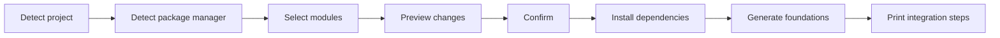

<div align="center">

# bink-rn-stack

Set up an opinionated foundation for an existing React Native or Expo application.

Choose the tools you want. Preview every change. Generate a consistent project structure in one command.

</div>

## What it does

`bink-rn-stack` inspects an existing application and guides it through a predictable setup flow:



- Detects Expo and bare React Native projects.
- Detects npm, Yarn, pnpm, or Bun.
- Offers an interactive module selector or non-interactive flags.
- Shows dependencies, generated files, conflicts, and native steps before changing anything.
- Installs only missing dependencies.
- Composes shared providers, stores, and barrel exports without duplicate files.
- Protects existing files unless an overwrite is explicitly requested.

## Supported modules

| Module             | Foundation                                                                               | Native rebuild |
| ------------------ | ---------------------------------------------------------------------------------------- | :------------: |
| **Axios**          | Configured client, API configuration, typed errors, and shared exports                   |       No       |
| **Unistyles**      | Themes, breakpoints, type augmentation, runtime configuration, and persisted theme state |      Yes       |
| **Zustand**        | State management foundation with an MMKV persistence adapter                             |      Yes       |
| **TanStack Query** | Query client, React Native lifecycle handling, and provider composition                  |       No       |
| **i18n**           | Typed resources, device-language detection, MMKV persistence, and language state         |      Yes       |

When multiple modules need the same foundation, such as MMKV storage, the generated output is shared instead of duplicated.

## Requirements

- Node.js 20 or newer.
- An existing Expo or bare React Native application.
- npm, Yarn, pnpm, or Bun configured through `packageManager` or a lockfile.

## Quick start

Run the CLI directly from npm—no cloning or global installation required:

```bash
npx bink-rn-stack init /path/to/your-app
```

The interactive flow asks whether to install the complete stack or select individual modules. After selection, it prints the full setup preview and asks for confirmation.

## Usage

### Interactive setup

```bash
npx bink-rn-stack init ../my-app
```

### Install the complete stack

```bash
npx bink-rn-stack init ../my-app --modules all
```

### Install selected modules

```bash
npx bink-rn-stack init ../my-app --modules axios,zustand,tanstack-query
```

### Preview without making changes

```bash
npx bink-rn-stack init ../my-app --modules all --dry-run
```

### Run non-interactively

```bash
npx bink-rn-stack init ../my-app --modules all --yes
```

### Inspect project detection as JSON

```bash
npx bink-rn-stack init ../my-app --json
```

## Command options

```text
npx bink-rn-stack init [path] [options]
```

| Option                    | Description                                                          |
| ------------------------- | -------------------------------------------------------------------- |
| `-m, --modules <modules>` | Select `all` or a comma-separated module list                        |
| `--dry-run`               | Print the complete preview without installing or generating anything |
| `-y, --yes`               | Apply the preview without asking for confirmation                    |
| `--force`                 | Replace existing generated paths whose contents differ               |
| `--json`                  | Print only the project-detection result as JSON                      |
| `-h, --help`              | Show command help                                                    |

Available module names are `axios`, `unistyles`, `zustand`, `tanstack-query`, and `i18n`.

## Generated structure

Selecting every module produces this foundation:

```text
src/
├── api/
│   ├── client.ts
│   ├── config.ts
│   ├── errors.ts
│   ├── index.ts
│   └── types.ts
├── i18n/
│   ├── locales/
│   │   └── en.json
│   ├── config.ts
│   ├── i18next.d.ts
│   ├── index.ts
│   ├── resources.ts
│   └── types.ts
├── providers/
│   ├── AppProviders.tsx
│   ├── index.ts
│   ├── QueryProvider.tsx
│   └── QueryProvider.types.ts
├── query/
│   ├── index.ts
│   └── queryClient.ts
├── stores/
│   ├── index.ts
│   ├── languageStore.ts
│   ├── mmkvStorage.ts
│   ├── themePreference.ts
│   └── themeStore.ts
└── theme/
    ├── breakpoints.ts
    ├── index.ts
    ├── themes.ts
    ├── types.ts
    ├── unistyles.d.ts
    └── unistyles.ts
```

The exact tree depends on the selected modules. Shared barrel files are composed from the final selection.

## Preview and safety

Every normal run displays a preview before applying the setup. The preview includes:

- Detected project type, root, and package manager.
- Selected modules.
- Dependencies that will be installed or skipped.
- The exact package-manager command.
- Files that will be created, left unchanged, or treated as conflicts.
- Required application integration and native rebuild steps.

Generated files follow these rules:

- A missing path is created.
- A file with identical content is left unchanged.
- A file with different content blocks setup before dependency installation.
- `--force` explicitly permits conflicting generated paths to be replaced.
- If dependency installation fails, source generation does not start.

Successful runs also create `.bink-rn-stack.json`. It records the CLI version, selected modules, generated paths, and content hashes. This metadata is intended to support safe update and removal commands in the future.

> [!CAUTION]
> `--force` replaces the complete contents of conflicting generated files. Always review the preview or commit your application changes first.

## Application integration

The CLI currently generates foundations but does not automatically rewrite the application entry point or Babel configuration. Follow the integration steps printed in the preview for the selected modules.

Depending on the selection, this can include:

- Importing `src/theme/unistyles.ts` before any `StyleSheet.create` call.
- Adding the Unistyles Babel plugin.
- Wrapping the application root with `AppProviders`.
- Importing `src/i18n/config.ts` before rendering the application.
- Creating a new Expo development build or rebuilding the native application.
- Running CocoaPods for a bare React Native iOS application.

## Project detection

Expo detection takes precedence because Expo applications normally depend on both `expo` and `react-native`. The CLI can recognize Expo from its dependency, the `expo` object in `app.json`, or conventional `app.config.*` files.

Package-manager detection checks the `packageManager` field first and then known lockfiles:

| Package manager | Recognized lockfiles                       |
| --------------- | ------------------------------------------ |
| npm             | `package-lock.json`, `npm-shrinkwrap.json` |
| Yarn            | `yarn.lock`                                |
| pnpm            | `pnpm-lock.yaml`                           |
| Bun             | `bun.lock`, `bun.lockb`                    |

Conflicting lockfiles are reported instead of silently choosing a package manager.

## Development

The following commands are for contributors working inside this repository:

| Command          | Purpose                                                  |
| ---------------- | -------------------------------------------------------- |
| `yarn dev`       | Run the CLI directly from TypeScript                     |
| `yarn format`    | Format the repository with Prettier                      |
| `yarn lint`      | Run ESLint                                               |
| `yarn typecheck` | Type-check the CLI and tests                             |
| `yarn test`      | Run the automated test suite                             |
| `yarn build`     | Compile the distributable CLI                            |
| `yarn validate`  | Run formatting, linting, type-checking, tests, and build |

Internal source imports use the `@/` alias for the `src` directory:

```ts
import { detectProject } from '@/core/detect-project.js';
```

The build rewrites internal aliases to Node-compatible relative imports in `dist`.

## Roadmap

- Compatibility-aware dependency resolution for each Expo SDK and React Native version.
- Automatic entry-point, provider, Babel, and Expo configuration integration.
- `doctor` and CI-friendly `check` commands.
- Transactional rollback when a setup step fails.
- Safe `add`, `update`, and `remove` workflows.
- User-defined presets, languages, theme tokens, and generator options.
